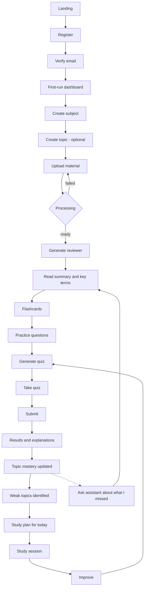
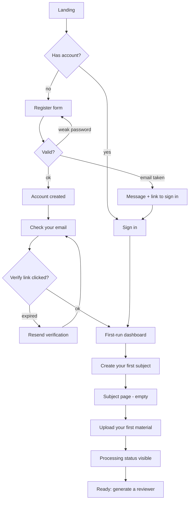
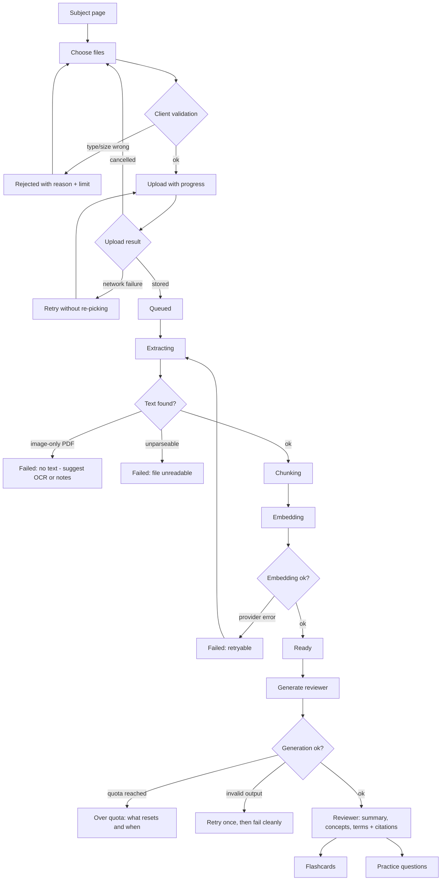
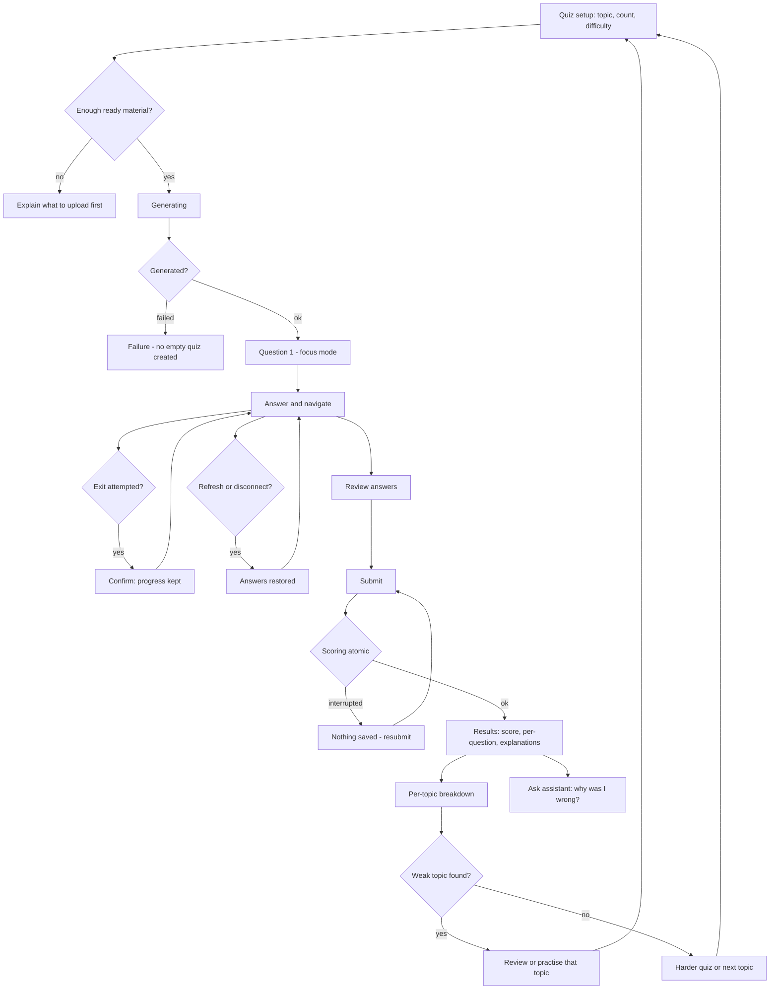
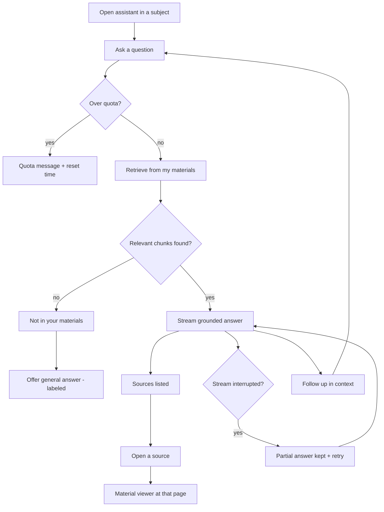
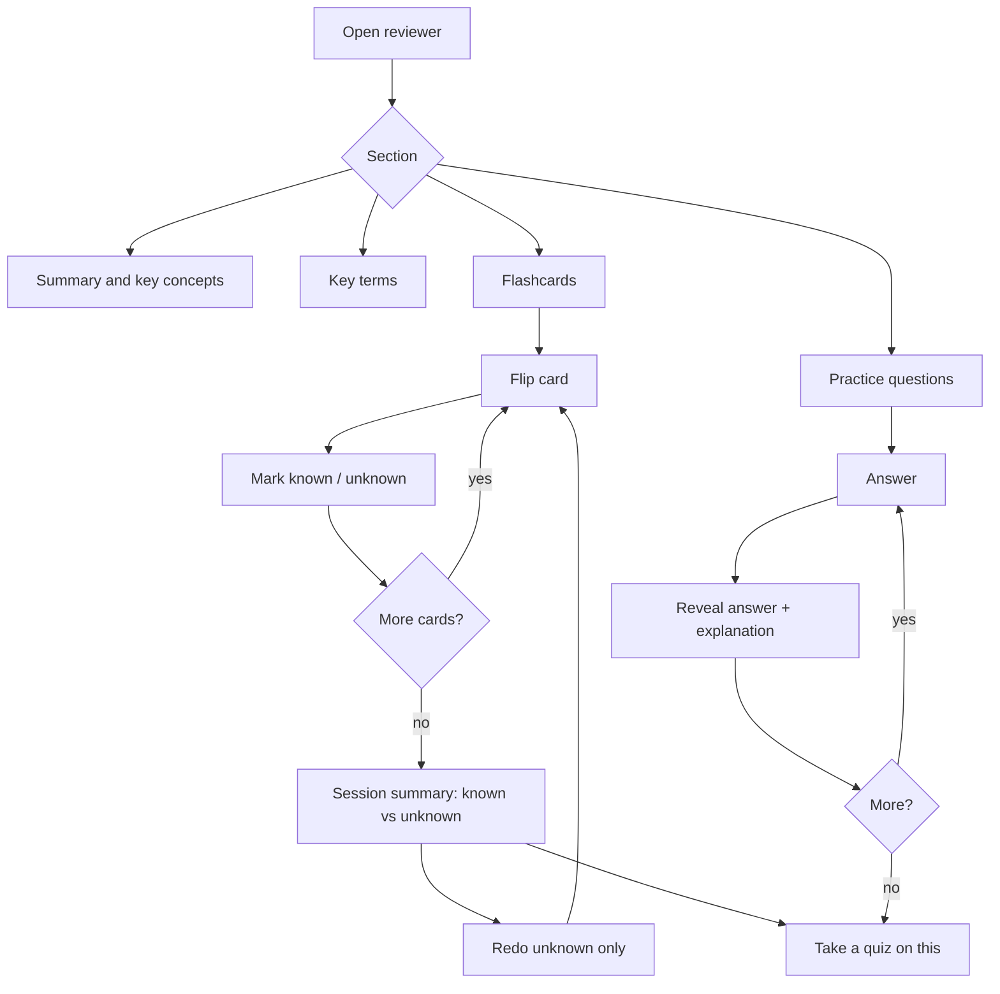
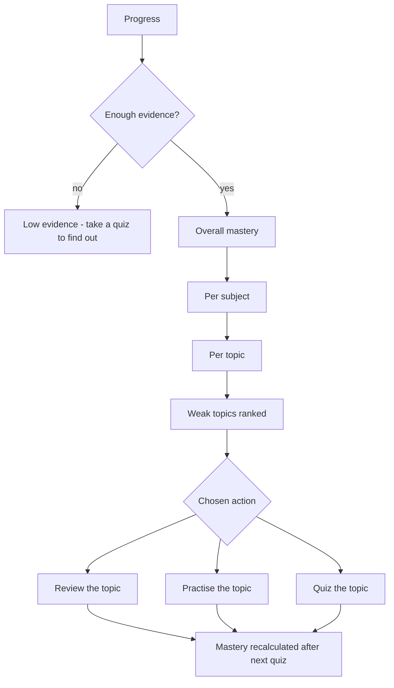
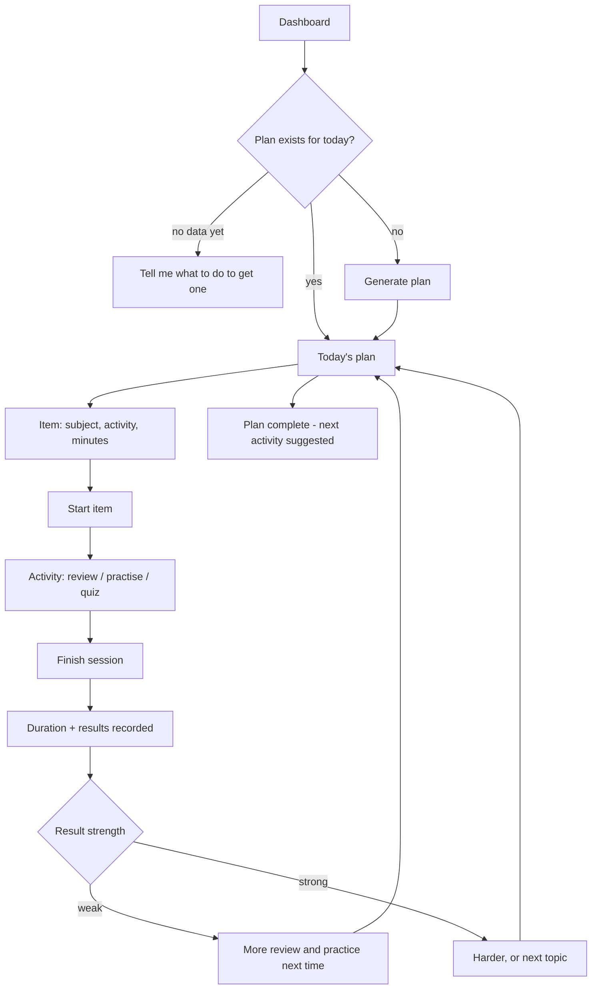
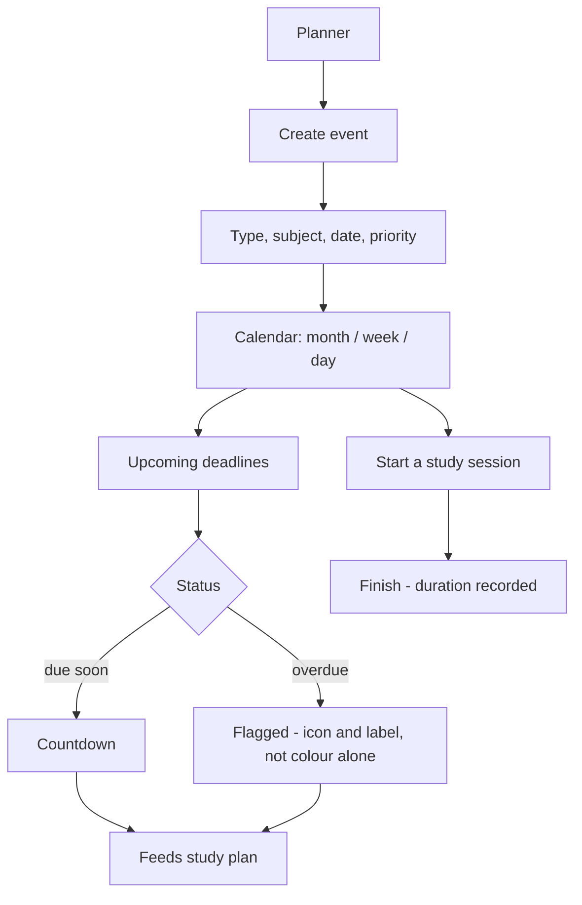

# Pawgress — User Flows

**Sprint 03 deliverable.** Maps the primary student journey and every branch that can go wrong.
Requirement and story ids refer to [`requirements.md`](requirements.md) and
[`user-stories.md`](user-stories.md).

Companion documents: [`navigation.md`](navigation.md) (routes and screens) ·
[`states.md`](states.md) (empty / loading / error states).

Flows are grouped as **F0–F9**. Each names its entry point, its success exit, and its failure
branches. Diagrams render on GitHub.

---

## F0 — The full journey

The spine from [`pawgress.md`](pawgress.md), with the real-world branches drawn in.

**MVP truncation:** the loop ends at *Weak topics* (R). `S`, `T`, `U` arrive in V1 with the planner
and plan engine. Until then, the weak-topic list links straight back to review or practice, closing
the loop manually.

---

## F1 — Onboarding

Entry: landing page or a shared link. Success exit: one subject with one `ready` material.

Design rules:

- **No onboarding wizard, no tour.** The first-run dashboard is a single call to action:
  create a subject. Everything else is hidden until there is something to show.
- An unverified user **can** sign in and use the app, with a persistent banner to verify. Blocking at
  the door loses the crammer persona entirely.
- Post-verification lands on the dashboard, never back on the marketing page.

Failure branches: `email taken` · `verification expired` · `verification email never arrives`
(resend, with a rate limit) · `wrong credentials`.

Covers: US-A1, US-A2, US-B1, US-J3 · FR-A1–A4, FR-D3

---

## F2 — Cold start to practice *(critical path)*

The flow the product is judged on. Entry: subject page. Success exit: the student is answering
questions about their own material.

Design rules:

- Processing is **never blocking**. The student can navigate away, and status is accurate when they
  return (US-D1).
- Each failure names its **stage** and its **cause**, and offers the specific next step. "Processing
  failed" alone is not acceptable copy.
- An image-only PDF is detected and named as such — it is the single most likely real-world failure
  with teacher handouts.
- Retry resumes at the failed stage and never duplicates chunks or embeddings (NFR-R1).

Covers: US-C1, US-C2, US-D1–D4, US-F1–F3 · FR-U1–U3, FR-P1–P6, FR-R1–R3

---

## F3 — Quiz cycle

Entry: subject page, reviewer, or weak topic. Success exit: an attempt recorded and mastery updated.

Design rules:

- Quiz taking is **focus mode**: no sidebar, no bottom nav, one deliberate exit.
- Answers persist locally as they are given, so a phone browser reload does not lose the attempt
  (US-G2).
- Results always name the next action. A score with no next step breaks the loop.

Covers: US-G1–G4, US-H3 · FR-Q1–Q6, FR-G1, FR-G3

---

## F4 — Ask the assistant

Entry: subject page, material viewer, or a wrong answer on a results screen.

Design rules:

- Scope is always **visible** — the student knows whether they are asking about one topic, one
  subject, or everything (US-E3).
- Citations are the product. An answer with no source, where sources were expected, is a defect
  (NFR success measure: ≥ 95% cited).
- Never invent a citation to satisfy the format.

Covers: US-E1–E3 · FR-C1–C4

---

## F5 — Review session

Entry: reviewer or weak topic.

Design rules:

- A flashcard session **resumes** where it stopped; a student on a bus does not restart at card 1.
- "Redo unknown only" is the whole point of marking cards — without it, marking is decoration.
- Practice questions are untracked deliberately: practice is low-stakes, quizzes are what feed
  mastery. Mixing them would corrupt the mastery signal.

Covers: US-F2, US-F3 · FR-R2, FR-R3

---

## F6 — Progress and weakness

Entry: dashboard, subject page, or after results.

Design rule: a mastery number without its evidence count is misleading. One lucky 3-question quiz is
not 100% mastery, and the UI must not say it is (US-H1).

Covers: US-H1–H3 · FR-G1–G4

---

## F7 — Plan a day (V1)

Covers: US-J1, US-J2 · FR-L1–L4

---

## F8 — Planner (V1)

Covers: US-I1–I3 · FR-N1–N4

---

## F9 — Recovery flows

Every one of these is a real state a student will hit. Each needs a designed screen, not a stack
trace.

| Situation | Behaviour | Story |
|---|---|---|
| Session expired mid-task | Re-auth in place, return to the same route, warn about unsaved input before losing it | US-A4 |
| Signed out, deep link clicked | Redirect to sign-in, then continue to the original destination | US-A3 |
| Upload fails mid-file | Per-file failed state with retry; other files in the batch continue | US-C1 |
| Processing fails | Stage + reason shown, retry from that stage, auto-stop after repeated failure | US-D2 |
| Generation returns malformed output | One silent retry, then a clean failure — never render partial junk | NFR-R4 |
| Over AI quota | State the limit, what it applies to, and when it resets | NFR-C1 |
| Quiz interrupted by reload or connection loss | Answers restored from local state; attempt resumable | US-G2, US-G6 |
| Submit interrupted | Nothing scored, resubmit available — no half-graded attempt | US-G3 |
| Subject or material deleted while open elsewhere | Not-found screen with a route back, not a crash | — |
| Offline | Reads show cached content where possible; writes queue or fail loudly. Never a silent no-op | — |
| Empty everything, new account | Every screen has a first-run state that names the one useful action | — |

---

## Cross-flow rules

1. **Every dead end has an exit.** No screen may leave the student with nothing to click.
2. **Every failure names a cause and a next step.** "Something went wrong" is a bug, not copy.
3. **Long work never blocks navigation.** Upload, processing, and generation all run in the
   background with status the student can leave and come back to.
4. **Destructive actions confirm with counts** — how many materials, quizzes, and attempts disappear.
5. **The loop always closes.** Results lead to weak topics; weak topics lead to review, practice, or
   a quiz. No terminal screens.
6. **Focus mode for quizzes only.** Everywhere else keeps the app shell so the student never feels
   lost.
